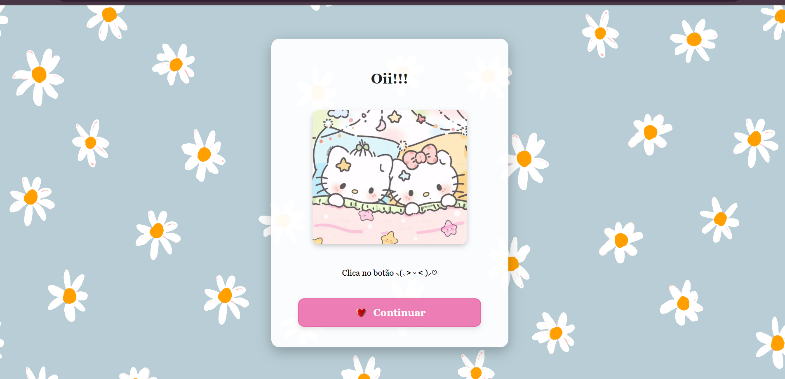
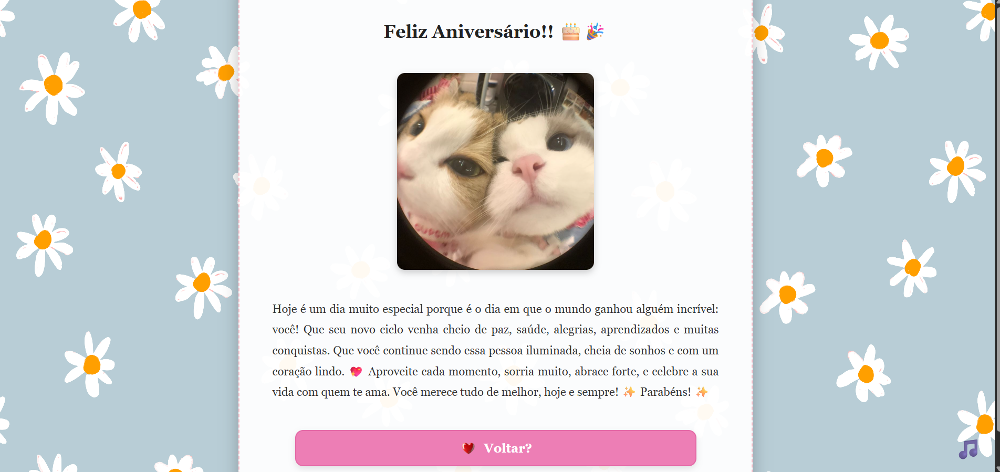

# 🎂 Feliz Aniversário! 🎉

Este é um mini-site interativo feito com muito carinho para celebrar o aniversário de uma pessoa especial. 💖

## ✨ Sobre o Projeto

Este projeto é composto por páginas HTML, CSS e JavaScript que guiam o usuário por uma experiência fofa e divertida com mensagens, imagens, música de fundo e escolhas interativas.

Ao navegar pelas páginas, o visitante encontra:

- Uma saudação inicial 💌  
- Uma pergunta fofa e interativa: "Quer abrir a cartinha?"  
- Um texto de aniversário cheio de amor e boas energias 💫  
- Música de fundo controlável 🎵

## 📁 Estrutura

📦 projeto-aniversario  
├── index.html           // Página inicial com saudação  
├── cartinha.html       // Escolha: abrir ou não a carta  
├── textocarta.html     // Mensagem de aniversário com música  
├── tentedenovo.html    // Mensagem caso escolha "não"  
├── script.js           // Controle da música de fundo  
├── styles/  
│   └── style.css       // Estilos gerais do projeto  
└── assets/  
    ├── musica.mp3  
    ├── coracao.png  
    ├── kittysad.png  
    ├── carta.jpeg  
    ├── hellokitty.jpeg  
    └── nos.jpeg  

## 🚀 Como Usar

1. Clone este repositório:  
   ```bash
   git clone https://github.com/EmellyCaixeta/projeto-aniversario.git
   
2. Abra o arquivo index.html no seu navegador preferido.
3. Navegue pelas páginas e aproveite a experiência interativa!

## 🎨 Tecnologias Utilizadas

- HTML5  
- CSS3  
- JavaScript (vanilla)  

## 🤝 Contribuições

Contribuições são bem-vindas!  
Se quiser ajudar a melhorar o projeto, fique à vontade para abrir issues ou pull requests.

## 📚 Referência

Este projeto foi inspirado na ideia apresentada no mini-site [YouWare - Project 8d73ndrpuw](https://www.youware.com/project/8d73ndrpuw?enter_from=personal_center).  
Todo o desenvolvimento e código foram feitos do zero, com adaptações e toques pessoais.

## 🖼️ Prévia do Projeto

Veja abaixo uma prévia de como o site funciona:

  

